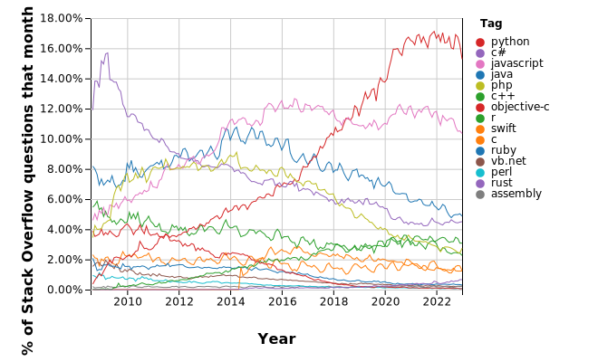

# sysen5260-2023-tdd-5lang retrospective

### HOw did your teammates collaborate to complete the assignment?
1. How did you split up the work? Which team members worked on what?
2. How were you able to use git/GitHub to facilitate collaboration?
3. What worked well? What could be improved? What changes would you make for your next project?

### Which language from the list C, Java, JavaScript, Go, Python do you think you would recommend for the following tasks? Write a sentence or two explaining why for each:
1. Writing a low-latency hardware driver.
 - C: (1) low-level access to hardware; (2) efficient memory management
1. Prototyping a new genomic search algorithm.
 - Python: (1) rich computing library: Numpy/SciPy/Scikit-learn/...
1. Implementing a high-performance genomic search algorithm.
 - Go: like C/C++, (1) efficient memory management; (2) optimized concurrency features, suitable for high concurrency scenarios
1. Building a large library for modeling complex financial instruments?
 - Java: has a mature back-end development framework, e.g. Spring, with excellent stability/robustness and portability for building large projects
2. Building a complicated user interface?
 - JavaScipt: almost irreplaceable in the field of front-end development, and has a rich library and development framework

### Rank the languages from most popular to least popular based on StackOverflow Trends. How do you explain these results?

From the chart, we can see that the current popular programming languages are:
1. Python
2. JavaScript
3. Java
4. C#
5. R
6. PHP
7. C++
8. C
9. Swift
10. Rust

 - Python is widely popular in the field of data analysis due to its simplicity and ease of use, as well as the availability of a large number of third-party libraries.

 - JavaScript is popular due to the widespread use of front-end development, and the availability of popular development frameworks such as React, Angular, and Node.js.

 - Java is popular in back-end development due to its cross-platform capabilities, stability, robustness, and extensive developer ecosystem.

 - C# is popular in Windows development due to its association with Microsoft.
