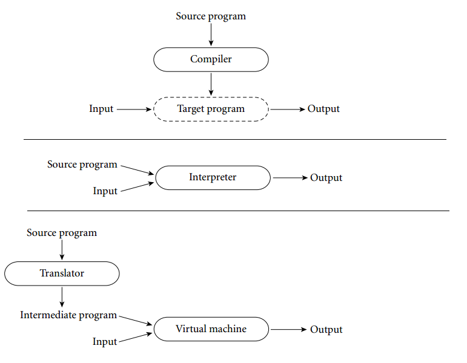
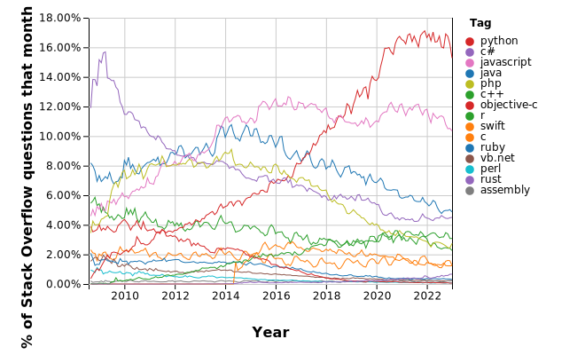

# Written Report (Java)

## Questions on Java
### Is Java a compiled language or an interpreted language?  Is Java statically typed or dynamically typed?



Compiled languages, interpreted languages and Java's execution model ("[Programming Language Pragmatics, Third Edition](https://github.com/YuqianZhang/Programming-Languages/blob/master/Programming%20Language%20Pragmatics%2C%20Third%20Edition.pdf), p. 20")


 - As shown in the diagram, the main difference between compilers and interpreters is the way in which they execute programs. 
   - A compiler translates source code into a machine-language executable file, while an interpreter directly interprets and executes the source code. A compiler only provides the functionality to translate one programming language into another, such as translating high-level programming languages into assembly language or machine language. After the source code is translated into an executable file, the executable file can be run directly on a computer without the support of a compiler. 
   - In contrast, an interpreter requires the existence of source code during program execution, as it interprets and executes the source code line by line. Interpreters are typically used for the execution of scripting or dynamic languages, as they do not need to translate source code into machine language or an executable file, and thus offer higher flexibility and portability.

 - For Java: to balance cross-platform compatibility and runtime efficiency, Java source code is first compiled into bytecode files (.class), which are not machine language but are intended to run on the JVM. The .class file is then interpreted on the JVM. Therefore, Java exhibits both the characteristics of a compiled language and an interpreted language. To achieve higher efficiency, the JVM also introduces a just-in-time (JIT) compiler, which further compiles the Java program into highly optimized machine code during runtime.

 - In summary, it can be difficult to categorize Java strictly as either a compiled or an interpreted language, as it exhibits both features of a compiled and an interpreted language.

### What is Maven? What are some of the things that we use Maven for in this project?

 - Maven:
   - is a Java project management tool that aims to simplify the process of building, dependency management, and documentation publishing in Java projects. 
   - uses an XML file (pom.xml) to describe the project's build process and dependencies, which automates and streamlines the processes of building, testing, and publishing documentation, while also managing the dependencies between multiple projects.
   - provides a vast array of plugins to extend its functionality, such as code quality checking, automatic documentation generation, and deployment to remote repositories.

 - Maven is similar to makefile. 
   - Makefile is a more general-purpose build tool primarily used for the build process of C/C++ projects, and it describes the dependency relationships and compilation rules between source files and header files. 
   - Compared to makefile, Maven is more flexible and streamlined for Java, as it does not require manual management of dependencies and compilation rules.

 - In summary, Maven is a Java-specific project management tool that simplifies the building, dependency management, and documentation publishing processes,etc.

 - In this project, we use Maven for project build configuration and management of project dependencies and plugins.
   - Dependencies: There are a total of 2 dependencies used in this project:
     - JUnit: A Java unit testing framework.
     - OpenCSV: An open source library for parsing CSV files in Java, which can convert CSV files to Java objects.
   - Plugins: There are a total of 6 plugins used in this project:
     - maven-compiler-plugin: Used to compile Java source code into bytecode files.
     - maven-surefire-plugin: Used to execute the project's unit tests.
     - maven-jar-plugin: Used to package the project into an executable JAR file.
     - maven-install-plugin: Used to install the project into the local repository.
     - maven-deploy-plugin: Used to deploy the project to a remote repository.
     - maven-assembly-plugin: Used to package the project into an executable JAR file, which includes all the required dependencies.

### We use the Java keyword new to create new instances of our Matrix class where we specify the size of the matrix.  Can we change the size of a matrix object after we create it?  What do you see in the code that makes you think so.

 - Once a matrix object is created, its size cannot be changed.

 - Since in the Matrix class, the size of the matrix is passed to the matrix object through the constructor, which allocates the necessary memory space for the object. The constructor initializes the size of the matrix using the nRows and nCols parameters, and the values array is allocated memory to store the data. Thus, once a matrix object is created and memory is allocated, its size cannot be changed. If it is necessary to change the size of the matrix, we can create a new matrix object and copy the data of the original matrix into it.


```java
public Matrix(int nRows, int nCols){
    this.nRows = nRows;
    this.nCols = nCols;
    this.values = new double[nRows][nCols];
}
```

### Additional information on Java code implementation

I added a test case to verify the correctness of matrix multiplication for matrices with different numbers of rows and columns, in addition to the original test function which only checked matrix multiplication for matrices with the same number of rows and columns.

## My answers to the retrospective part

### Which language from the list C, Java, JavaScript, Go, Python do you think you would recommend for the following tasks? Write a sentence or two explaining why for each:
1. Writing a low-latency hardware driver.
 - C: (1) low-level access to hardware; (2) efficient memory management
1. Prototyping a new genomic search algorithm.
 - Python: (1) rich computing library: Numpy/SciPy/Scikit-learn/...
1. Implementing a high-performance genomic search algorithm.
 - Go: like C/C++, (1) efficient memory management; (2) optimized concurrency features, suitable for high concurrency scenarios
1. Building a large library for modeling complex financial instruments?
 - Java: has a mature back-end development framework, e.g. Spring, with excellent stability/robustness and portability for building large projects
2. Building a complicated user interface?
 - JavaScipt: almost irreplaceable in the field of front-end development, and has a rich library and development framework

### Rank the languages from most popular to least popular based on StackOverflow Trends. How do you explain these results?



Source: insights.stackoverflow.com/trends

From the chart, we can see that the current popular programming languages are:
1. Python
2. JavaScript
3. Java
4. C#
5. R
6. PHP
7. C++
8. C
9. Swift
10. Rust

 - Python is widely popular in the field of data analysis due to its simplicity and ease of use, as well as the availability of a large number of third-party libraries.

 - JavaScript is popular due to the widespread use of front-end development, and the availability of popular development frameworks such as React, Angular, and Node.js.

 - Java is popular in back-end development due to its cross-platform capabilities, stability, robustness, and extensive developer ecosystem.

 - C# is popular in Windows development due to its association with Microsoft.